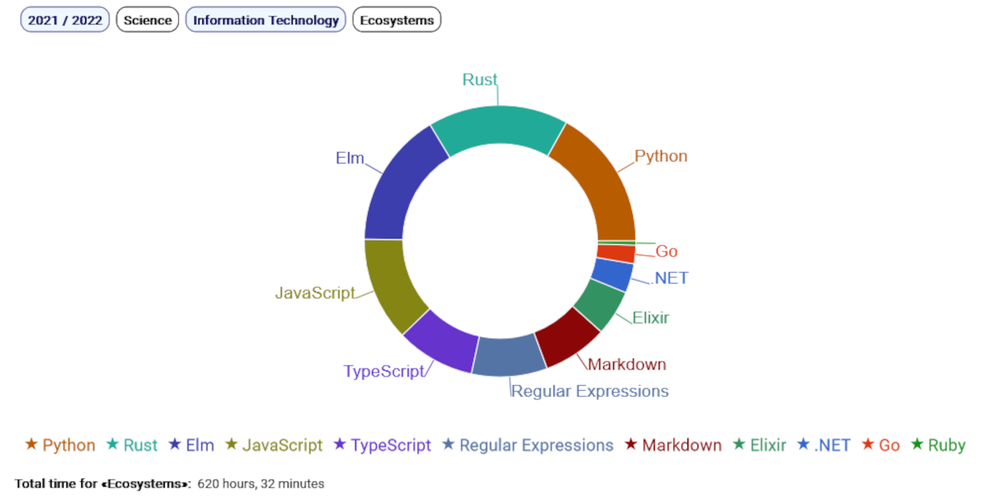

# OmniCourse

_Interactive, React-based drill-down analysis of your learning experience_


[](https://badge.fury.io/js/@giancosta86%2Fomnicourse)
[](/LICENSE)



## Introduction

**OmniCourse** is a **TypeScript** library for **React** dedicated to the multi-level analysis of one's _learning experience_.

More precisely, its **\<OmniCourse\>** component displays **pie charts** and **reports** automatically generated from **taxonomies** of **subjects** that classify **works** (online courses, books, talks, ...).

**Interactive drill-down** is its core analytical feature: when the user _selects a taxonomy_ or _clicks on a pie slice_, the component shows the subjects/works contained in the related _taxonomy level_; of course, **a breadcrumb navigation bar** enables _arbitrary backtracking_ during the drill-down exploration.

OmniCourse is designed to be the kernel of the [learning area](https://gianlucacosta.info/#learning) on my [personal website](https://gianlucacosta.info/) - but I wanted to package it as a library to make it accessible to everyone!🦋

## Installation

OmniCourse can be installed like any NPM package:

```bash
yarn add @giancosta86/omnicourse
```

It is written in **TypeScript**, so you can take advantage of type definitions & annotations.

The public API entirely resides in the root package index, so you shouldn't reference specific modules.

For details about _installing and using OmniCourse_, please consult the [tutorial wiki page](https://github.com/giancosta86/OmniCourse/wiki/3.-Tutorial).

## New features in OmniCourse 2

- _Well-defined model_ written in **TypeScript**, with remarkably high **test coverage** on the model

- Default **CSS stylesheet** out of the box - as a working basis for further customization

- Support for **deferred loading** from **arbitrary data sources**, with _opt-in caching_

- **Auto-drilldown**: if the current taxonomy level only contains _one subject_ (it is not _meaningful_), the React component automatically displays that subject's items by simulating a user click - recursively

- **Path continuity**: when the user _switches between taxonomies_, OmniCourse tries to _reuse as many breadcrumbs as possible_ from the current taxonomy path, by automatically diving into the new taxonomy

- **Download button** - so that users can download either a PNG of the current chart or the current work report in JSON format

- Almost identical _raw descriptor format_ - with **full backwards compatibility**

- **Stricter input validation**, including prevention of _duplicate sibling works_ within a subject

- **Sorting algorithm**, for both subjects and works

- Advanced **chart customization** settings

## Using the library

OmniCourse is described in detail in its [wiki](https://github.com/giancosta86/OmniCourse/wiki); in particular, please refer to the [core model](https://github.com/giancosta86/OmniCourse/wiki/2.-Core-model) and [tutorial](https://github.com/giancosta86/OmniCourse/wiki/3.-Tutorial) sections.

## See also

- [OmniCourse - wiki](https://github.com/giancosta86/OmniCourse/wiki)

- [Ulysses](https://github.com/giancosta86/ulysses) - Simplified generation of OmniCourse descriptors

- [Recharts](https://recharts.org/)
