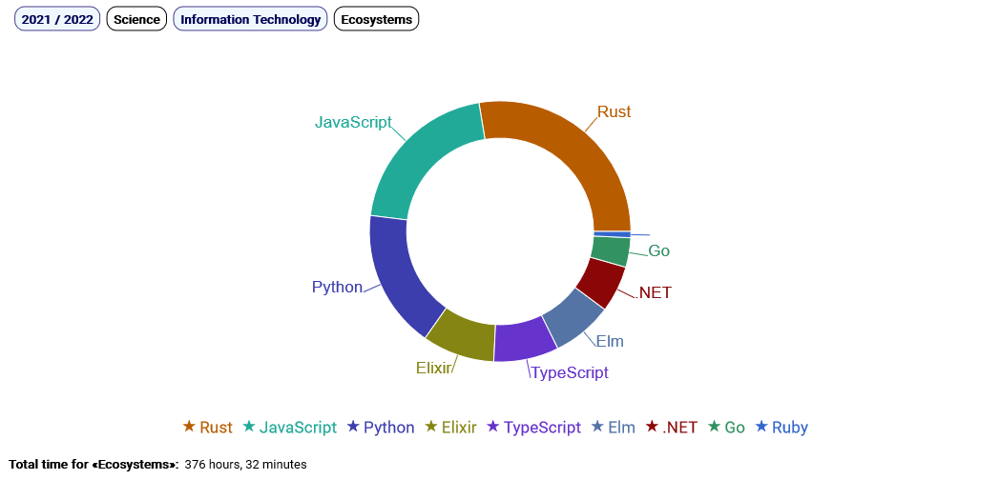

# @giancosta86/omnicourse

_React component for drill-down chart analysis of online courses_

[](https://www.npmjs.com/package/@giancosta86/omnicourse) [](https://travis-ci.org/giancosta86/OmniCourse)



## Introduction

**OmniCourse** is a tiny library (just a few hundred lines! ^\_\_^), completely written in **ES6** and **JSX**, providing a **React** component dedicated to performing aggregated, decomposable analysis of _completed online courses_.

More precisely, its **CourseReport** component displays arbitrarily-nested taxonomies of courses in the form of _pie charts_: when the user clicks on a pie slice, a **drill-down** is performed, up to the _table summarizing the details_ of the courses belonging to the chosen path.

To improve the user experience, the UI also includes **a breadcrumb navigation bar** to enable arbitrary backtracking during the drill-down exploration, as well as **a footer with grand-total counters** for the selected slice.

OmniCourse is designed to be the kernel of the **learning area** of my [personal website](https://gianlucacosta.info/) - but I wanted to package it as a library, despite its simplicity, to make it available to anyone willing to share their **knowledge**! ^\_\_^

## Installation

```bash
npm install --save @giancosta86/omnicourse
```

OmniCourse is currently _transpiled_ and _polyfilled_ to _ES5_ via **Babel** with **core-js@2** and **regenerator**. In particular, it is designed to be compatible with:

- **Gatsby** projects, for static website generation

- projects created via **create-react-app**

## Usage

```jsx
import React, { Component } from "react"
import { CourseReport } from "@giancosta86/omnicourse"

class Example extends Component {
  render() {
    return <CourseReport sourceData={} rootLabel=""/>
  }
}
```

To see a more concrete example in action, please refer to its minimalist [test web application](https://github.com/giancosta86/OmniCourse-Test/), published on GitHub as well.

### Properties

- **sourceData** (mandatory): course data, described using a dedicated, very simple JS-based notation (see **Data format** below)

- **rootLabel** (mandatory): text of the label for the **select** component in the navigation bar

- **className**: the class of the top-level **div** generated by the component. See **CSS styling** below

- **loader**: JSX component to be displayed while the chart is loading

- **colors**: array of colors used as a color palette by the charts. Please, refer to the documentation of _react-google-charts_ for more details

## CSS styling

**OmniCourse provides no styling** - _it is up to you to decide how to style the elements_! However, a sensible default - that is, the one depicted in the screenshot - can be found in the [example web application](https://github.com/giancosta86/OmniCourse-Test/): please, feel free to start by copying the contents of its **index.scss** stylesheet.

For further details, the following pseudocode describes the DOM tree created by the **CourseReport** component:

```scss
div.<CourseReport className property> {
  nav.path-bar {
    label.root-label
    select.root-select
    button.internal.path-component
    span.leaf.path-component
  }

  .course-chart

  div.table-container {
    table.course-table {
      thead {
        tr {
          td.title
          td.duration
          td.completion-date
          td.portal
          td.certificate
        }
      }

      tbody {
        tr {
          td.title
          td.duration
          td.completion-date
          td.portal
          td.certificate
        }
      }
    }
  }

  footer.context-summary {
    div.total-duration {
      label
      span
    }

    div.total-courses {
      label
      span
    }
  }
}
```

## Data format

_Course taxonomies_ are described via _plain JavaScript notation_ - which is much easier to see than to explain: in particular, please refer to the **courses.js** file in the [example web application](https://github.com/giancosta86/OmniCourse-Test/).

### Format rules

- the **sourceData** object passed to **CourseReport** is a JavaScript object where:

  - each **key** will be shown as an item in the **select** component of the navigation bar; consequently, in case of spaces or other characters not allowed in identifiers, you can _express the key as a string_

  * each **value** can be either:

    - **another object**, thus introducing _a conceptual subtree_ where the same rules apply

    - **an array of courses**, where each **course** is described by an object whose meaningful fields are:

      - **title** (mandatory)

      - **minutes** (mandatory): the duration in minutes

      - **url**: the official URL. If present, the course title in the course table will be displayed as a link pointing to such URL

      - **portal**: the portal hosting the course. If missing, it could be inferred from the URL

      - **completionDate** - if present, it should be in **YYYY-MM-DD** format

      - **certificateUrl** - if present, a link to such URL will be shown in the course table

## License

Apache-2.0 © [giancosta86](https://github.com/giancosta86)

## Third-party libraries

- [React](https://reactjs.org/)

- [react-google-charts](https://github.com/RakanNimer/react-google-charts)

- [Babel](https://babeljs.io/)

- [core-js](https://github.com/zloirock/core-js)

- [regenerator-runtime](https://github.com/facebook/regenerator/tree/master/packages/regenerator-runtime)

- [Jest](https://jestjs.io/)
